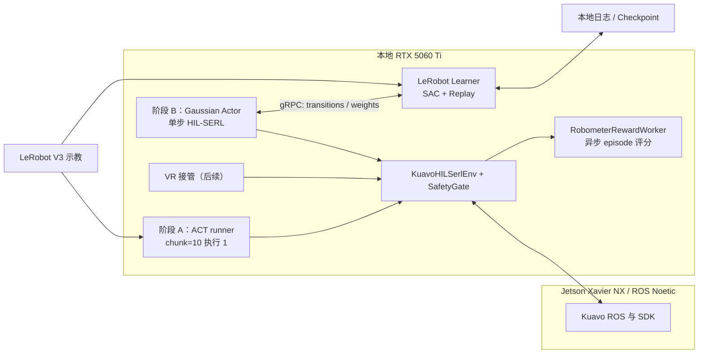

# Kuavo × LeRobot v0.6.1 HIL-SERL 实机闭环强化学习工程部署与实施手册

> 用途：后续执行 AI 的施工规范。目标是在本仓库中将 LeRobot v0.6.1 的 HIL-SERL（Human-in-the-Loop Sample-Efficient Reinforcement Learning）安全适配到 Kuavo ROS 仿真与真机。
>
> 总原则：**依赖基线 → 上游仿真 → Kuavo 仿真适配 → 影子真机 → 受控真机 MVP**。任一验收不通过，禁止进入下一阶段。本文中的“目标命令”必须在对应程序、配置和测试实现后再执行，禁止将其误认为现有 CLI。
>
> 文中引用的上游 import 路径、模块名和 CLI 以 `third_party/lerobot` 当前 v0.6.1 实际代码为准；如与文档不符，以代码为准并回写文档，禁止为迁就文档魔改上游。

---

## 1. 结论与项目边界

### 1.1 结论

项目技术上可行，也值得做；但不能把上游 HIL-SERL 配置直接套到 Kuavo 上运行。

当前 `third_party/lerobot` 已升级至 **v0.6.1**，已有完整的：

- `gaussian_actor` 策略与 `sac` 算法；
- actor / learner 分布式架构，基于 gRPC 传递 transition 和策略权重；
- online/offline replay 混合训练；
- 人工干预动作与干预率记录；
- 统一 reward API（reward classifier、SARM、TOPReward、Robometer）与图像处理器。

Kuavo 主工程已有 ROS 观测缓存、关节 action space、限幅、插值、暂停/停止话题。因此工作重点是建立安全的 Kuavo adapter，而不是自研 RL 框架。

首个目标固定为：**双臂但不控制底盘/腿部、固定工作空间、低速、单任务、成功可明确判定**。MVP 任务为“物料框搬运到胸前”，与现有 `data/lerobot/lerobot_merged` 示教数据同任务。底盘移动、长时程装配和复杂灵巧手任务不属于首版范围。

### 1.2 最终决策：两阶段策略，模型不混用

本项目分两个明确阶段推进，复用**同一份** 16-D action、state、图像、ROS adapter 与 SafetyGate 契约：

| 阶段 | 目的 | 模型与动作语义 | 产物 |
|---|---|---|---|
| A：模仿学习基线 | 验证数据、相机、动作映射、延迟和安全闭环 | ACT；`chunk_size=10`，每轮只执行预测 chunk 的第 1 个 16-D 动作，随后重新观测重新预测 | ACT checkpoint、BC 成功率、影子/真机基线 |
| B：真机 HIL-SERL | 在安全约束内用在线 reward 优化策略 | LeRobot 原生 `gaussian_actor + sac`；每个 `env.step()` 只输出并记录**一个** 16-D 动作 | Gaussian Actor checkpoint、SAC replay、相对 ACT 基线的改善指标 |

**禁止将 ACT 的 action chunk 当作 SAC/HIL-SERL 的 action。** 上游 SAC critic、replay buffer 和 actor-learner gRPC 协议都以单步 action transition 为语义；把 chunk 塞进 replay 会破坏 critic target。ACT checkpoint 也不能直接加载为 Gaussian Actor 权重。两个阶段可迁移的资产是：环境与安全层、数据契约、观测预处理、离线示教（经 reward 校准后可入 offline replay）、以及阶段 A 的成功率基线。

进入阶段 B 的放行条件：阶段 A 的 ACT 在真机上达到可复现的非零成功率，且全链路延迟、安全联锁、观测契约全部验收通过。若 ACT 基线都无法工作，问题在数据或工程链路，先修再谈 RL。

### 1.3 已确定的首版运行方案

| 项 | 已确定方案 |
|---|---|
| MVP 任务 | 双臂“物料框搬运到胸前”；不控制底盘/腿部 |
| 部署拓扑 | actor、learner、Robometer worker 全部在本地 RTX 5060 Ti；Jetson Xavier NX 仅运行 ROS/Kuavo SDK，二者低延迟 LAN 直连 |
| 阶段 A 控制 | ACT `chunk_size=10`，每轮只执行第 1 步 |
| 阶段 B 控制 | Gaussian Actor 单步 16-D 输出，SAC 在线优化 |
| 控制频率 | 目标 10 Hz；实测 P95 端到端延迟超过 100 ms 时必须降频（5 Hz），禁止积压动作队列 |
| 输入图像 | head / left wrist / right wrist 三路 RGB；以 head camera timestamp 为主轴在 10 Hz 确定性对齐；不做动态内容裁剪 |
| 图像处理 | 确定性解码、颜色、尺寸与归一化流水线，使实时输入和训练数据 `3×480×848` 契约逐像素一致 |
| reward 模型 | `lerobot/Robometer-4B`，通过 LeRobot reward API 接入；仅服务于阶段 B |
| reward 执行 | 异步 worker；episode 结束时评分为必须，dense progress 为可选；绝不阻塞控制循环 |
| 人工接管 | 后续接入 VR；当前预留统一 16-D action + intervention 事件接口，不作为阶段 A 的前置条件 |
| 动力学限制 | 手臂速度/加速度上限取 TOPP NORMAL 限值的 0.8 倍，左右臂各复用一套 |

手臂单侧最终动力学上限（0.8 × TOPP NORMAL）：

```text
velocity_rad_s      = [6.64, 2.56, 4.24, 2.56, 4.24, 4.24, 4.24]
acceleration_rad_s2 = [20.0, 20.0, 20.0, 20.0, 40.0, 40.0, 40.0]
```

### 1.4 当前阻断项

| 项 | 现状 | 风险/结论 |
|---|---|---|
| LeRobot | v0.6.1 | 已具备目标 RL 框架 |
| HIL-SERL extra | 代码有 `hilserl` extra | 当前项目镜像尚未明确安装，需补齐 |
| Kuavo 环境 | `KuavoBaseRosEnv` 已是 Gym 环境 | 可复用 ROS，但不符合上游 HIL-SERL 机器人接口 |
| 奖励 | `compute_reward()` 返回 0 | SAC 没有学习信号，必须修复 |
| episode 边界 | `step()` 固定 `terminated=False, truncated=False` | replay target 错误，必须修复 |
| 安全信号 | 有 pause/stop ROS topic | 必须下沉到 `env.step()` 实际下发前 |
| GPU 显存 | 5060 Ti 单卡承载三类负载 | 必须先做显存预算（见 1.8），不通过则 Robometer 离线化 |
| episode reset | 物料框需人工放回 | 必须定义 reset 流程与吞吐量（见 1.9） |

### 1.5 已确认的 Kuavo 5W v62 实机契约

| 项 | 已确认值 | 实施含义 |
|---|---|---|
| 机型 | Kuavo 5W v62（`LUNBI_V62`） | 所有 manifest、配置和日志必须写入机型 |
| 机器人主控 | Jetson Xavier NX | 仅运行 ROS/Kuavo SDK；不部署 actor/learner |
| 控制范围 | 双臂，非底盘/腿部 | action 仅 16-D；严禁向腿部或底盘输出控制 |
| action 布局 | `[zarm_l1..l7, left_claw, zarm_r1..r7, right_claw]` | 16-D 固定顺序；夹爪归一化 `[0,1]` |
| action 语义 | 绝对关节位置 | 策略输出不是 delta；安全层仍需限制**相邻命令差分** |
| state 单位 | rad | 读取 `/sensors_data_raw` 后保持 rad |
| ROS arm 命令 | `/kuavo_arm_traj`，14-D，deg | adapter 只在最终发布边界做 `rad → deg`，且有单测 |
| ROS state | `/sensors_data_raw`，28-D，rad | 双臂取 `[12:26]`（见 1.6） |
| 图像 | 三路 compressed RGB，约 30 FPS | 10 Hz actor 以 head camera timestamp 为对齐主轴；写入前验证 RGB 与 CHW/HWC |
| 发布/推理 | 10 Hz，848×480 | 首轮可降至 5 Hz；不得超过实测延迟能承受的频率 |
| 末端 | `leju_claw × 2` | 输出先限幅 `[0,1]`，再映射至 command 的 `[0,100]` 量纲 |
| URDF | `src/kuavo_assets/models/biped_s62/urdf/drake/biped_v3_arm.urdf` | 当前仓库未发现此路径；实施前需同步或配置外部绝对路径 |
| EE | base=`torso`；left=`zarm_l7_end_effector`；right=`zarm_r7_end_effector` | 首版关节控制；后续 EE/IK 必须以这些 frame 重新验证 |

### 1.6 state 索引契约（已解析，仍需现场 preflight）

数据集 QC（`pada_summary.json`）已明确转换规则 `"state_arm_layout": "28->12:26, 20->4:18, 14->0:14"`：**索引按原始 state 维度选择**。v62 的 `/sensors_data_raw` 是 28-D，因此双臂取 `[12:26]`；`configs/platform/platform_config.yaml` 中通用 `5w` 的 `[4:18]` 只适用于 20-D 变体。这不是矛盾，而是必须按维度分派的规则。

执行者必须创建 `scripts/rl/verify_joint_map.py`，在**不下发策略动作**的静态 preflight 中打印：原始 state 维度、关节名称、`[12:26]` 切片值和夹爪值，并与数据集 `meta/stats.json` 的量级对照。只有实时结果与数据集契约一致，才允许启用真机策略。结果固化为 `configs/rl/kuavo_v62_joint_map.yaml`。

### 1.7 离线数据适用性结论

现有离线数据为“码垛：物料框搬运到胸前”的遥操作数据（LeRobot V3，16-D，10 Hz），**没有人工成功/失败标签**。用途分级：

1. **立即可用**：阶段 A 的 ACT/BC 训练；action/state/camera 契约校验。
2. **校准后可用**：经 Robometer 离线打分 + 人工 episode 级抽查复核后，作为阶段 B 的 offline replay 与 reward 校准集。
3. **禁止**：未校准前直接作为带 reward 的 SAC replay；跨任务混入 replay。

### 1.8 GPU 显存与算力预算（阶段 B 放行条件）

RTX 5060 Ti（16 GB）需同时承载三类负载。进入阶段 B 前必须实测并记录：

| 负载 | 预估显存 | 说明 |
|---|---|---|
| Gaussian Actor 推理（actor 进程） | 1–2 GB | 含图像编码器 |
| SAC learner（含 replay 采样与优化） | 3–6 GB | 取决于 batch size 与图像分辨率 |
| Robometer-4B（fp16/bf16 推理） | 约 8–10 GB | 4B 参数视频-语言模型 |

三者峰值合计可能逼近或超过 16 GB。**规定**：

1. actor + learner 优先占用；Robometer worker 仅在两者稳定后加载。
2. 若同驻显存不可行，Robometer 采用 **episode 间串行模式**：episode 结束后加载/推理/卸载，或使用 int8/int4 量化；再不行则完全离线批处理 rollout。
3. 任何配置下禁止 Robometer 抢占导致 actor 推理超时；显存和耗时必须写入实验 manifest。
4. 若 Robometer 只能离线化，在线 reward 退化为：人工事件（接入 VR 前由安全员按键）+ 确定性安全故障惩罚 + 超时截断，Robometer 分数事后回填 replay。

### 1.9 episode reset 与实验吞吐量

真机 RL 的吞吐量由 reset 决定，不是由算法决定。必须在阶段 A 就固化：

1. **reset 定义**：双臂回到固定初始姿态（低速插值），物料框由人工放回标定的起始区域（地面胶带或定位挡块标定）。
2. **吞吐量目标**：单 episode ≤ 15 s + reset ≤ 20 s，即每小时 ≥ 100 个 episode；低于每小时 60 个时必须优化 reset 流程而不是延长 session。
3. **初始状态分布**：物料框起始位置允许 ±2 cm 摆放误差并记录；禁止每次刻意摆放到完全相同位置（会造成过拟合的窄初始分布）。
4. 每个 session 前用 checklist 确认：初始姿态可达、工作空间无障碍、急停在手边。

### 1.10 不做的事

1. 不让阿里云 ECS 通过公网控制真机。云端仅做离线训练、评分、归档；真机闭环全部在本地低延迟 LAN。
2. 不通过关闭限幅、放宽工作空间、禁用急停来增加“探索”。
3. 不对 action 进行静默 reshape、补零、截断或单位猜测。
4. 不把 Kuavo topic、SDK、控制逻辑硬编码进 `third_party/lerobot`。
5. 不在真机上首次验证 gRPC、依赖、奖励或动作语义。
6. 不把 ACT chunk 写入 SAC replay，不把 Robometer 放进 10 Hz 同步控制路径。

---

## 2. 目标架构



### 2.1 进程职责

| 模块 | 运行位置 | 职责 | 禁止事项 |
|---|---|---|---|
| ROS / Kuavo SDK | Jetson Xavier NX | 相机、机器人状态、底层控制、硬保护 | 不承担训练 |
| `KuavoHILSerlEnv` + SafetyGate | 本地 5060 Ti | Gym API、观测、动作、episode、安全状态转译与最终下发 | 不实现 SAC |
| ACT runner（阶段 A） | 本地 5060 Ti | chunk=10、只执行第一步、BC 基线评测 | 不写入 HIL-SERL replay |
| HIL-SERL actor（阶段 B） | 本地 5060 Ti | Gaussian Actor 单步推理、采样、上传 transition | 不使用 ACT chunk |
| learner（阶段 B） | 本地 5060 Ti | replay、SAC、checkpoint、推送权重 | 不直接发 ROS 控制命令 |
| Robometer worker | 本地 5060 Ti | 异步 episode/progress 评分 | 不能成为唯一安全机制，不能阻塞 actor |

---

## 3. 上游接口与适配策略

### 3.1 必用上游接口

| 能力 | 位置 | 接入原则 |
|---|---|---|
| 分布式配置 | `lerobot/rl/train_rl.py` | 使用 `TrainRLServerPipelineConfig` |
| actor | `lerobot/rl/actor.py` | 复用 gRPC、transition、权重更新流程 |
| learner | `lerobot/rl/learner.py` | 尽量原样复用 |
| 策略 | `lerobot/policies/gaussian_actor/` | `policy.type: gaussian_actor` |
| 算法 | `lerobot/rl/algorithms/sac/` | `algorithm.type: sac` |
| HIL 处理链 | `lerobot/rl/gym_manipulator.py` | 复用 processor 思路，Kuavo 单独分发 |
| reward | `lerobot/rewards/robometer/` | inference-only；异步 worker 封装 |

> v0.6+ 的正确配置是 `policy.type: gaussian_actor` 与 `algorithm.type: sac`。禁止写旧的 `policy.type: sac`。文中 import/CLI 以实际代码为准。

### 3.2 两类策略的边界

- **ACT 基线（阶段 A）**：沿用项目现有训练与部署路径；`chunk_size=10`、每轮执行第 1 步。不使用 HIL-SERL actor/learner，不产生 SAC transition。
- **HIL-SERL（阶段 B）**：仅使用 `gaussian_actor + sac`；每次 `env.step(action)` 接收单一 16-D action。不调用 ACT chunk runner。
- **共同部分**：`KuavoHILSerlEnv`、`SafetyGate`、ROS adapter、观测预处理、action contract、故障语义、日志格式，必须被两个阶段复用并单测。

### 3.3 Reward 与控制循环的职责分离

LeRobot 提供 HIL-SERL 闭环和 reward 模型 API 两部分能力，但通用 reward 模型不会自动替代环境 reward，必须自行接线：

- `KuavoHILSerlEnv` 负责确定性部分：安全故障、stop、陈旧观测直接写入负奖励与终止，不等待任何模型。
- `RobometerRewardWorker` 异步消费 episode 缓冲（轨迹帧 + 任务文本），调用 `lerobot/Robometer-4B` 输出 progress/success，回填该 episode 的 transition reward。
- 频率分离：阶段 A 的 ACT 与阶段 B 的 Gaussian Actor 都以 10 Hz 出动作；Robometer 仅在 episode 结束时必须运行，资源验证通过后才允许 0.5–1 Hz 的异步 progress。**禁止任何 10 Hz 控制帧同步等待 4B 模型。**

### 3.4 Robometer-4B 校准标准（上线门禁）

上线前对现有示教 + 若干故意失败的 rollout 离线打分，必须同时满足：

1. **单调性**：对成功示教，episode 内 progress 总体单调上升（允许局部噪声，Spearman 相关 ≥ 0.7）；
2. **区分度**：成功 episode 的末帧分数显著高于失败 episode（人工判定为标准，AUC ≥ 0.85）；
3. **鲁棒性抽查**：变光照、遮挡、空抓、半途放下等困难样本上无系统性误判。

不满足则不允许作为在线 reward，只能旁路记录；此时在线 reward 退化为 1.8 节第 4 条的确定性方案。校准数据与结论写入 `data/reward_calibration/`。

### 3.5 推荐新增结构

```text
kuavo_rl/
├── __init__.py
├── config.py                    # 配置 dataclass、强校验
├── env.py                       # KuavoHILSerlEnv，Gymnasium API
├── ros_adapter.py               # ROS state/image/action 边界与单位转换
├── act_runner.py                # 阶段 A：chunk=10、只执行第一步
├── adapter.py                   # 阶段 B：HIL-SERL 环境工厂桥接
├── teleop.py                    # 统一人工接管输入/事件（VR 预留）
├── reward.py                    # Robometer 异步评分、人工事件与故障惩罚融合
├── safety.py                    # SafetyGate，可独立单测
├── recording.py                 # 在线数据、manifest 与审计记录
└── tests/
    ├── test_action_contract.py
    ├── test_observation_contract.py
    ├── test_episode_semantics.py
    ├── test_act_execute_first.py
    ├── test_safety_gate.py
    ├── test_actor_learner_smoke.py
    └── test_robometer_worker.py
configs/rl/
├── act_kuavo_bc.yaml
├── gym_hil_baseline.json
├── kuavo_hilserl_sim.yaml
├── kuavo_hilserl_shadow.yaml
├── kuavo_hilserl_real_mvp.yaml
└── robometer_reward.yaml
scripts/rl/
├── preflight.py
├── verify_joint_map.py
├── score_rollouts_robometer.py
├── run_act_baseline.sh
├── run_learner.sh
└── run_actor.sh
```

### 3.6 适配方式选择

- **首选**：新增 `kuavo_rl` 和 Kuavo launcher，在主仓库完成环境工厂桥接。
- **可接受的最小上游修改**：仅在上游环境工厂增加一个通用可注册 hook；专有逻辑仍留在主仓库。
- **禁止**：将 `KuavoSDK`、ROS topic、部署配置写入 `third_party/lerobot`。

---

## 4. 已确定事实与放行验证

以下内容**已确定**，执行 AI 不得自行改动：

1. MVP 是“物料框搬运到胸前”，只控制双臂和两只夹爪；
2. action 为 `[left 7 rad, left_claw, right 7 rad, right_claw]` 的 16-D 绝对关节位置；
3. v62 28-D raw state 双臂取 `[12:26]`；ROS 发布前手臂 rad → `/kuavo_arm_traj` 14-D deg；夹爪 `[0,1]` → `[0,100]`；
4. actor、learner、Robometer worker 同在本地 RTX 5060 Ti；Jetson 仅运行 ROS/SDK；
5. 阶段 A 用 ACT `chunk_size=10` 每轮执行第 1 步；阶段 B 用单步 `gaussian_actor + sac`；
6. reward 用 `lerobot/Robometer-4B` 异步 episode 评分起步，须先通过 3.4 校准门禁；
7. 手臂速度/加速度上限为 TOPP NORMAL 的 0.8 倍。

以下是**实施放行验证**（须实测冻结到配置，不是方案待决）：运行中 ROS topic 类型/频率/时间戳、`[12:26]` 实际映射、rad/deg 发布边界与 SDK 内部是否重复转换、stop 端到端延迟、16-D joint position bounds、相邻命令最大差分、观测最大 age、success/failure 的几何阈值（物料框到达胸前区域的判定）。未验证前禁止下发 policy action。

每次实验建立 manifest：

```bash
cd ~/robot-il/LeTools-Learning
source deploy.env
python -c "import lerobot, torch; print(lerobot.__version__, torch.__version__)"
git rev-parse HEAD
git -C third_party/lerobot rev-parse HEAD
nvidia-smi
```

记录根仓库 commit、子模块 commit、镜像 digest、CUDA、torch、GPU、ROS 与 Kuavo SDK 版本；不得只记录 `latest`。

---

## 5. 分阶段施工与验收

## Phase 0：依赖基线（0.5–1 天）

### 任务

1. 修改 `docker/setup_env_docker.sh`，在一次受控依赖解析中包含：

```bash
python -m pip install -e "third_party/lerobot[training,dataset,hilserl]"
```

2. 处理 torch 版本来源：根 `requirements.txt` 固定 `torch==2.9.1`，而 LeRobot v0.6.1 允许 `torch>=2.7,<2.12`。锁定最终 resolved 组合，不能用多个 `pip install` 互相覆盖。
3. 建议拆镜像：
   - `letools-train`：原有离线训练；
   - `letools-rl-learner`：`training,dataset,hilserl`；
   - `letools-rl-actor`：ROS/Kuavo SDK + 最小推理与 HIL-SERL 依赖。
4. 验证依赖（import 名称以实际代码为准，失败时先核对上游再改脚本）：

```bash
python - <<'PY'
import grpc, gym_hil, torch
from lerobot.rl.train_rl import TrainRLServerPipelineConfig
print('HIL-SERL imports OK; CUDA:', torch.cuda.is_available())
PY
python -m lerobot.rl.actor --help
python -m lerobot.rl.learner --help
```

### 验收门禁

- [ ] `grpc`、`gym_hil` 可导入；actor/learner help 可解析。
- [ ] 无 torch/torchvision/CUDA ABI 冲突。
- [ ] 原有 ACT 训练/推理 smoke 仍通过。
- [ ] 训练 Python 3.12 与 ROS Noetic Python 3.8 二进制包未强行混在同一运行路径。

失败时：先分离 learner 与 ROS actor 环境，禁止使用 `--no-deps` 或硬覆盖二进制依赖逃避问题。

## Phase 1：上游 HIL-SERL 仿真基线（1–2 天）

先只使用 `gym_hil`，不接 Kuavo。目标是证明 HIL-SERL、gRPC、replay 与权重回传可运行。

1. 新建 `configs/rl/gym_hil_baseline.json`：

```json
{
  "env": {"type": "gym_manipulator", "name": "gym_hil", "task": "PandaPickCubeKeyboard-v0", "fps": 10},
  "policy": {"type": "gaussian_actor", "device": "cuda"},
  "algorithm": {"type": "sac"}
}
```

> 无手柄时使用 Keyboard 任务变体；有手柄可换 `PandaPickCubeGamepad-v0`。

2. 启动顺序：learner 必须先启动，actor 后启动。

```bash
python -m lerobot.rl.learner --config_path configs/rl/gym_hil_baseline.json
python -m lerobot.rl.actor --config_path configs/rl/gym_hil_baseline.json
```

### 验收门禁

- [ ] actor 成功连接 learner，退出后端口释放，无僵尸进程。
- [ ] online replay 增长；配置离线数据时 offline replay 可采样。
- [ ] learner 有优化 step 和 checkpoint；actor 收到新权重。
- [ ] 人工干预标志进入 transition，日志能观测干预率。
- [ ] 不连接 Kuavo 时不导入 `kuavo_humanoid_sdk`/ROS。

## Phase 2：共享 Kuavo 环境契约与仿真适配（3–5 天）

### 目标

实现 `KuavoHILSerlEnv`。先只连接 `Kuavo-Sim`，完整符合 Gymnasium：

```python
obs, info = env.reset(seed=seed)
next_obs, reward, terminated, truncated, info = env.step(action)
```

该环境同时服务阶段 A（ACT runner 调用）与阶段 B（HIL-SERL actor 调用）。

### 强制数据契约

| 项 | 规定 |
|---|---|
| observation | 仅使用稳定标准 key：`observation.state`、`observation.images.<camera>` |
| state | dtype `float32`，16-D，顺序每步恒定 |
| image | 明确 RGB、CHW/HWC、`uint8`/float；不可隐式转换 |
| action | 16-D，绝对关节位置 rad + 夹爪 `[0,1]` |
| reward | Python float 或标量 tensor；成功正值，安全故障负值 |
| terminated | 成功或不可恢复故障 |
| truncated | 超时、人工 abort、暂停超时、通信/观测异常 |
| info | 至少含 `is_intervention`、`success`、`fault_code`、`action_clipped`、时间戳 |

### 动作方案（v62 固化契约）

```text
policy / replay action: [zarm_l1..zarm_l7, left_claw, zarm_r1..zarm_r7, right_claw]
shape:                  [16]
arm unit:               rad
claw unit:              normalized [0,1]
ROS arm publish:        /kuavo_arm_traj, shape [14], deg
ROS claw publish:       /leju_claw_command，独立于 arm topic
```

适配器职责严格分层：

1. policy 输出 16-D 规范动作；
2. `SafetyGate` 在规范动作空间检查 shape、NaN、position bounds、相邻动作最大差分、速度/加速度（1.3 节 0.8×TOPP 值）、夹爪范围；
3. 拆成 14-D arm 和两个夹爪；只在 ROS publisher 前将手臂 `rad → deg`；
4. 夹爪 `[0,1]` → `[0,100]`；
5. 写入原始、裁剪后、最终发布三套 action 用于审计。

`/kuavo_arm_traj` 的 14-D deg 事实必须以当前运行 ROS 消息为准。SDK `control_arm_joint_positions()` 是否已内部完成 rad/deg 转换，必须通过单元测试和低幅静态测试确认；禁止重复转换。

虽然模型输出是绝对位置，SafetyGate 仍必须约束相邻发布命令的差分/速度，避免一次策略更新或观测跳变造成关节跃迁。EE-delta/IK 版本需另行完成 URDF 同步与 frame 验证；未完成前不允许启用上游 SO100 的 IK pipeline。

### 必须修复的既有逻辑

1. `compute_reward()` 不得继续返回固定 0；改为 reward provider。
2. `step()` 不得固定返回 `False, False`；必须产生成功、超时、故障、人工终止边界。
3. 每个实际动作下发之前必须执行 safety gate；不能只由外层评测脚本检查 pause/stop。
4. 检查图像、关节、夹爪观测的最大 age 和跨 topic 时间差；陈旧观测时不得下发新动作。
5. clip 要记录；连续 clip 超过阈值必须截断 episode。

### 验收门禁

- [ ] mock ROS/SDK 单测通过，无硬件可运行。
- [ ] 仿真中连续 reset/step 100 episode 无资源泄漏。
- [ ] policy features 与 env observation/action space key、shape、dtype 完全一致。
- [ ] action NaN、shape 错、越界、陈旧观测、stop、SDK exception 都有确定 fault code。
- [ ] ACT runner 与 HIL-SERL actor 调用同一个 `env.step()` 时安全机制均生效。

## Phase 3：Robometer 奖励、VR 接管预留与事件记录（3–6 天）

### 3.1 VR 接管预留：`KuavoTeleopAdapter` 标准输出

- `action`：与 policy action 同维度、同单位、同语义（16-D）；
- `is_intervention`：接管期间每帧为 true；
- `success`、`failure`、`abort`：边沿事件；
- `deadman`：许可键，未持续按下时不得下发人工遥操动作。

| 事件 | 行为 |
|---|---|
| deadman + 接管 | 人工 action 覆盖模型 action，并记录 intervention |
| success | `terminated=True`，赋成功奖励 |
| failure / abort | `truncated=True`，写明原因 |
| pause | 不下发新动作；超时则截断 |
| stop / 物理急停 | 立即阻断动作通道，标记故障并结束 actor |

VR 未接入期间，由安全员通过按键面板产生 success/failure/abort 事件（不产生 action）；接管 action 通道留空但接口、日志和 replay 字段先行实现并单测。不得把接管实现成“只暂停模型”；接管动作一旦接入必须进入 replay。

### 3.2 Robometer-4B reward 实施

按 3.4 节校准门禁先离线验证，再按以下顺序上线：

1. **旁路评分**：对示教与新 rollout 离线打分并人工抽查（`scripts/rl/score_rollouts_robometer.py`）；
2. **episode reward**：正常结束 episode 用 Robometer success/progress；超时 `0`；确定性安全故障 `-1`；
3. **低频 progress（可选）**：仅在 1.8 显存预算与延迟验证通过后，以异步 0.5–1 Hz 引入 progress 增量；
4. **人工事件融合**：安全员/VR 的 success/failure/abort 永远优先于模型评分。

若 Robometer worker 超时、OOM 或出错：本 episode 标记 `REWARD_MODEL_ERROR`，降级到确定性 episode 规则（人工事件 + 安全惩罚 + 超时 0），禁止复用旧 reward 填充。

### 验收门禁

- [ ] 接管、释放、成功、失败、暂停、急停都有审计日志与可回放事件。
- [ ] 人工事件正确产生 episode 边界与 reward。
- [ ] Robometer 通过 3.4 校准门禁（单调性、区分度、鲁棒性），报告存档。
- [ ] Robometer worker 崩溃/超时不影响控制循环，降级路径经过测试。

## Phase 4：离线 V3 数据审计与 ACT 基线（2–4 天）

### 数据审计

对照数据集与实时 env：

| 数据项 | 必须一致 |
|---|---|
| 图像 | camera key、RGB/BGR、分辨率、预处理、帧时间对齐 |
| state | 关节顺序、rad、`[12:26]` 切片、夹爪量纲 |
| action | 绝对位置、16-D、控制频率、范围 |
| episode | 边界、长度、视频可解码 |
| task | 初始状态、物体、背景、成功标准 |

实现 `scripts/rl/preflight.py` 输出 JSON 报告：dataset features、统计量、episode 时长、NaN/Inf、动作越界比例、相机缺失、时间戳差。

### ACT 基线训练（阶段 A 起点）

用 `lerobot_merged` 训练 ACT（`chunk_size=10`），仿真/影子验证“预测 10、执行 1”路径。该基线的成功率是阶段 B 的对照组。

### 验收门禁

- [ ] 数据能构建/采样 replay buffer；与实时 env 契约一致或有显式可测 transform。
- [ ] `[12:26]`、16-D action、`/kuavo_arm_traj` 14-D deg 的映射经转换测试（含左右臂和双夹爪）。
- [ ] ACT 训练收敛，离线指标合理；“执行 1 步”逻辑有单测（`test_act_execute_first.py`）。
- [ ] 不兼容数据被拒绝，禁止 silent padding/reshape；离线数据只读挂载。

## Phase 5：分阶段端到端仿真（3–5 天）

1. **阶段 A**：Kuavo-Sim 中运行 ACT runner；验证 chunk=10 只执行第 1 步、无积压队列；记录 BC 成功率、clip、P95 延迟。
2. **阶段 B**：同一环境先启动 learner 再启动 actor，运行单步 Gaussian Actor + SAC 闭环；不得启动 ACT runner。
3. Robometer 作为异步 episode 评分 worker 接入；记录显存、耗时、评分与人工抽查一致性。
4. 对照实验：零动作、随机动作、ACT 基线、SAC。**SAC 相对 ACT/BC 基线无可解释改善时，禁止进入真机阶段 B**，先诊断 reward、reset 分布与数据契约。

### 验收门禁

- [ ] 阶段 A 100 个仿真 episode 无崩溃，ACT 只执行每个 chunk 的第一步。
- [ ] 阶段 B actor 实际应用 learner 推送的新权重；replay 中 action 为单一 16-D，未混入 chunk。
- [ ] Robometer 异步运行不拖慢控制循环；显存和耗时有记录（对照 1.8 预算）。
- [ ] 无 NaN、action mismatch、stale observation 继续执行。
- [ ] SAC 相对基线有可解释结果。

## Phase 6：影子真机与安全演练（1–2 天）

影子模式使用真实观测、完整策略、完整 safety gate，但**绝不将 policy action 下发给机器人**；仅记录预测动作、clip、风险和延迟。阶段 A 与阶段 B 的策略都要过影子模式。

### 放行清单

- [ ] `scripts/rl/verify_joint_map.py` preflight 通过：28-D、`[12:26]`、关节名、量级与数据集一致。
- [ ] 物理急停已现场演练并有效；`/kuavo/stop_state` 的实测阻断延迟已记录。
- [ ] 每位操作者了解接管、成功、失败、停止流程；reset 流程按 1.9 演练。
- [ ] P95 观测到动作延迟在控制周期预算内；否则降频。
- [ ] 影子预测动作无持续越界、错误关节顺序、高 clip 比例、NaN/Inf。

## Phase 7：受控真机 MVP（3–7 天实验迭代）

仅在 Phase 6 完整通过后执行。顺序：**先阶段 A 的 ACT 真机基线，后阶段 B 的 HIL-SERL**。约束：双臂但不控制底盘/腿部、低速、固定工作空间、无损任务物体、安全员在场、每 session 限定最大时长和步数。

配置示意（字段实现后以实际 dataclass 为准）：

```yaml
env:
  type: kuavo_hilserl
  fps: 5
  task: box_to_chest_mvp
  safety:
    max_consecutive_clips: 3
    observation_max_age_s: 0.15
  episode:
    max_steps: 75
    max_duration_s: 15
policy:
  type: gaussian_actor
  device: cuda
  storage_device: cuda
  online_step_before_learning: 200
  online_buffer_capacity: 20000
  offline_buffer_capacity: 20000
  actor_learner_config:
    learner_host: 127.0.0.1
    learner_port: 50051
    policy_parameters_push_frequency: 2
algorithm:
  type: sac
  temperature_init: 0.01
  utd_ratio: 1
dataset:
  repo_id: lerobot_merged
  root: /data/lerobot/lerobot_merged
online_ratio: 0.5
wandb:
  enable: false
```

阶段 B 的探索控制：初始温度取小值（如上 0.01），并考虑将 Gaussian Actor 的动作范围约束到示教数据统计范围（`meta/stats.json` 的 min/max 外扩少量余量），避免高斯噪声在 16-D 关节空间被 SafetyGate 大量 clip、有效探索归零。

目标启动方式：

```bash
# 终端 A：learner，必须先启动
python -m lerobot.rl.learner --config_path configs/rl/kuavo_hilserl_real_mvp.yaml

# 终端 B：未来新增的 Kuavo actor launcher
python -m kuavo_rl.actor --config-path configs/rl/kuavo_hilserl_real_mvp.yaml
```

第二条不是当前已存在命令；没有实现 adapter/launcher 前禁止执行。

每 session 后必须复盘：reward、成功率、干预率、clip、fault、动作/观测延迟分位数、权重版本、失败帧/视频、Robometer 评分与人工判定一致率。任何未预期动作、安全故障、SDK 异常发生后，立刻停止后续采样，先修安全链。

---

## 6. SafetyGate 规范

每次 `env.step()` 的固定顺序：

1. 检查 ROS shutdown、stop、硬件 fault；若失败，阻断下发。
2. 校验 action shape、dtype、NaN/Inf、动作契约版本。
3. 限制单步差分、速度/加速度（0.8×TOPP）、joint position bounds。
4. 检查观测新鲜度和跨 topic 对齐；失效则不执行新动作。
5. 人工接管优先，且需 deadman 有效。
6. 下发带 episode/step/weight version 审计 metadata 的动作。
7. 获取新的、对齐的 observation。
8. 计算确定性 reward 部分、terminated、truncated 和 info（模型 reward 由异步 worker 回填）。

推荐故障码：

```text
NONE
STOP_SIGNAL
ROS_SHUTDOWN
STALE_OBSERVATION
ACTION_NAN
ACTION_SHAPE
ACTION_LIMIT
VELOCITY_LIMIT
SDK_EXCEPTION
RESET_TIMEOUT
HUMAN_ABORT
EPISODE_TIMEOUT
REWARD_MODEL_ERROR
```

暂停不等于停止：pause 时不得重复发送旧 action；超过超时必须截断。stop 必须阻断底层动作通道并结束 actor。物理急停是最后保护层。

---

## 7. 测试矩阵

| 层级 | 必测内容 | 通过标准 |
|---|---|---|
| 单元 | action contract、reward 融合、fault 状态机、ACT“执行 1 步” | 关键安全分支覆盖 |
| 契约 | policy feature 与 env space | key/shape/dtype/action 完全匹配 |
| mock ROS | stop、陈旧 topic、SDK exception | 不下发危险动作，fault 正确 |
| gRPC | 服务、断连、重连、权重版本 | 无死锁；可恢复或安全退出 |
| reward | Robometer worker 崩溃/超时/OOM | 控制循环不受影响，降级正确 |
| 上游 sim | gym_hil HIL-SERL | actor/learner 可训练 |
| Kuavo sim | 两阶段完整链 | 100 episode 无崩溃 |
| 影子真机 | 延迟、clip、preflight | 无高风险异常 |
| 真机 MVP | 受控 session | 安全门全程生效 |

```bash
pytest -q kuavo_rl/tests
pytest -q third_party/lerobot/tests/rl
```

硬件测试不得成为默认 CI；必须显式标记，并在现场确认后执行。

---

## 8. 数据、模型与复现

```text
/data/
├── lerobot/lerobot_merged/            # 离线示教，只读
├── rl_online/<experiment_id>/         # 在线 episode / transitions
├── reward_calibration/                # Robometer 校准数据与报告
├── rl_runs/<experiment_id>/           # learner checkpoint、日志、resolved config
├── act_runs/<experiment_id>/          # 阶段 A ACT checkpoint 与评测
└── manifests/<experiment_id>.json     # 完整版本与硬件信息
```

每个 transition 至少记录：experiment ID、episode ID、step ID、时间戳、actor 权重版本、observation/action contract 版本、人工干预、reward 来源（robometer/manual/safety/timeout）、termination reason、fault code、clip 信息。

绝不提交 token、AK/SK、W&B key、机器人网络凭据、数据、checkpoint、bag。

---

## 9. 风险、失败模式与止损

按崩塌概率排序：

| # | 风险 | 后果 | 防护 |
|---|---|---|---|
| 1 | Robometer reward 与真实成功弱相关 | SAC reward hacking 或不学习 | 3.4 校准门禁、人工事件优先、旁路先行 |
| 2 | reset 吞吐量不足 | 数据攒不够，项目死于采样效率 | 1.9 吞吐量目标、reset 流程演练、每小时 episode 数监控 |
| 3 | 16-D 关节空间探索被安全层 clip 归零 | 学不到任何改善 | 小温度、动作范围收缩到示教统计范围、clip 率监控 |
| 4 | 人工接管缺位（VR 未接入） | HIL 退化为纯在线 SAC，成功率长期为零 | 安全员事件按键先行；成功率连续为零时暂停并优先接入 VR |
| 5 | 5060 Ti 显存不足 | OOM 或控制频率骤降 | 1.8 预算与串行/量化/离线降级路径 |
| 6 | 离线/实时动作语义不一致 | 错误关节动作 | action contract、preflight、影子模式 |
| 7 | 延迟超过控制周期 | 过时动作/抖动 | 低频 MVP、P95 测量、降频 |
| 8 | Python ROS ABI 冲突 | cv_bridge/相机崩溃 | learner/actor 分镜像 |
| 9 | 上游深度 fork | 后续无法升级 | 主仓库 adapter、最小 hook |

以下任意条件成立，应暂停 RL 项目而不是继续真机探索：

1. Robometer 校准不通过且无人工 reward 通道；
2. 机器人无法稳定 reset 到窄初始状态，或每小时 episode 数 < 60 且无法改进；
3. 端到端延迟无法满足任务且无法降频；
4. 阶段 A 的 ACT 基线在真机上成功率为零（先修数据/工程，不进阶段 B）；
5. 离线数据不能转换到真机 action contract；
6. 现场急停和安全员流程不可用。

退路：BC + DAgger 数据闭环、缩小到单臂或更短时程子任务、或先做 EE 空间低维版本。这是正确止损，不是工程失败。

---

## 10. 工期估算

| 阶段 | 工期 | 条件 |
|---|---:|---|
| Phase 0 依赖基线 | 0.5–1 天 | Docker/GPU 正常 |
| Phase 1 上游仿真 | 1–2 天 | HIL-SERL extra 可用 |
| Phase 2 Kuavo adapter + 仿真 | 3–5 天 | ROS/动作契约明确 |
| Phase 3 Robometer、接管预留、日志 | 3–6 天 | 校准数据可用 |
| Phase 4 数据审计 + ACT 基线 | 2–4 天 | 可访问 V3 数据 |
| Phase 5 分阶段端到端仿真 | 3–5 天 | 两类策略边界清晰 |
| Phase 6 影子真机 | 1–2 天 | 现场与安全设备可用 |
| Phase 7 真机 MVP 调参 | 3–7 天 | 可连续预约机器人 |
| **首个工程 MVP** | **16–32 工作日** | 不含硬件故障/数据重采 |

若要新建 Kuavo URDF IK、微调/替换视觉 reward、重采大规模数据或进入长时程任务，再增加 2–12 周实验迭代。

最低人员配置：一名 Python/RL 工程师 + 一名 Kuavo ROS/现场安全工程师。任何真机 session 至少两人：安全操作者与监控记录者。

---

## 11. 给执行 AI 的硬约束

1. 任何真机相关改动先写测试，先仿真，后影子模式，最后真机。
2. 不将 Kuavo 专有逻辑写入上游子模块；如需最小 patch，先说明升级影响。
3. 不允许固定零 reward 和固定 `False/False` episode 语义进入 actor。
4. 不允许 silent reshape、pad、truncate 修复 action 不一致。
5. stop、通信故障、观测陈旧必须在环境内部阻止下发，外层检查不算完成。
6. actor 连不上 learner 时不得执行机器人动作。
7. learner 先启动，actor 后启动；配置必须冻结到实验目录。
8. HIL-SERL 只使用单步 `gaussian_actor + sac`；ACT chunk 不得写入 SAC replay。
9. Robometer 不进入 10 Hz 同步路径；校准不通过不得作为在线 reward。
10. 未通过影子模式，禁止下发 policy action 到真机。
11. 发生碰撞、异常姿态、SDK 异常或急停延迟超标后，停止 session，保存证据，先修复再继续。

---

## 12. Definition of Done

以下全部满足，才可称“Kuavo 已适配 LeRobot HIL-SERL MVP”：

- [ ] 目标镜像实际安装 `lerobot[hilserl]`，依赖和版本可复现；
- [ ] Kuavo adapter 在主仓库，Gymnasium 与特征契约通过测试；
- [ ] reward、success、failure、timeout、stop、stale observation 有可测语义；
- [ ] Robometer 校准报告存档，在线 reward 路径与降级路径经过测试；
- [ ] VR 接管接口与事件记录已预留；接入后其动作和标志进入阶段 B replay；
- [ ] 离线 V3 数据已审计；ACT 基线可训练，reward 校准后可安全进入 SAC offline replay；
- [ ] 上游 sim 与 Kuavo sim 两阶段闭环均通过；
- [ ] 影子真机已量化并通过 preflight、延迟、clip 和 stop 测试；
- [ ] 在受控双臂、非底盘 MVP 中分别完成 ACT 基线和 HIL-SERL 实验，实验工件完整；
- [ ] 报告成功率、干预率、安全指标和每小时 episode 数相对 ACT/BC 基线的结果，而不是只展示一次成功视频。
