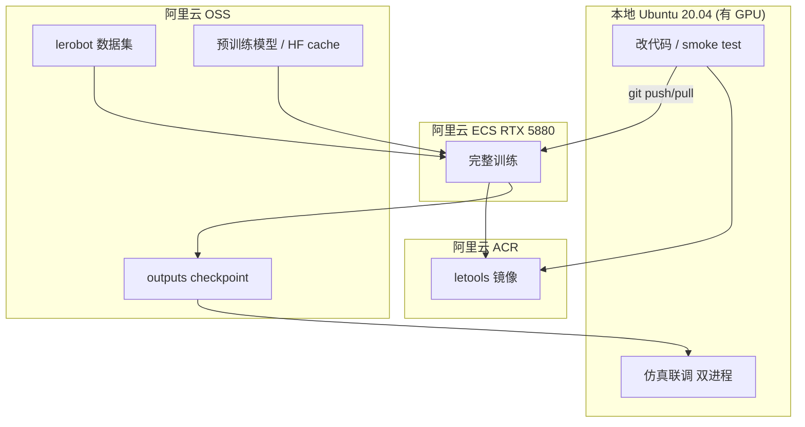

# LeTools-Learning 本地开发 + 阿里云训练 + 本地仿真 —— 最终落地方案

> 本文档是给执行 AI 的施工蓝图。请**按阶段顺序**执行，每个阶段末尾有验收标准，未通过不要进入下一阶段。
> 文档参考官方资料：
> - [零基础完整学习教程](https://www.letools.lejurobot.com/docs.html#get_started/beginner_tutorial.md)
> - [Installation](https://www.letools.lejurobot.com/docs.html#get_started/installation.md)

---

## 0. 已确认的前提（不要再假设，直接采信）

| 项 | 确认值 |
|----|--------|
| 本地系统 | Ubuntu 20.04，**有 NVIDIA GPU** |
| 云端 | 阿里云 ECS GPU 实例，**RTX 5880 Ada 48GB 单卡**（Ada 架构，算力 8.9） |
| 数据 | 已有 **LeRobot V3** 格式数据（lerobot ≥ 0.4.0），训练阶段跳过 rosbag 转换 |
| 策略 | ACT / Diffusion / PI0 / PI05 都会用；PI0/PI05 **先用 lerobot 版**，openpi 原生版按需 |
| 仿真 | 在**本地**跑（本地有 GPU），双进程：`kuavo-ros-opensource`(仿真) + `LeTools-Learning`(推理) |
| 主仓库 | `LeTools-Learning` |

### 需要执行 AI 在开工前向用户索要 / 现场确认的占位值

施工前必须把下列占位符替换为真实值（在下面命令中以 `<...>` 标注）：

- `<REPO_URL>`：LeTools-Learning 仓库地址（官方或用户 fork）
- `<ACR_REGISTRY>`：阿里云容器镜像服务地址，例：`registry.cn-hangzhou.aliyuncs.com`
- `<ACR_NS>`：ACR 命名空间
- `<OSS_BUCKET>`：OSS Bucket 名
- `<OSS_ENDPOINT>`：OSS 内网 Endpoint（与 ECS 同地域），例：`oss-cn-hangzhou-internal.aliyuncs.com`
- `<CUDA_VER>`：由 `nvidia-smi` 右上角实测得到（如 12.4 / 12.8），**镜像与 conda cuda-toolkit 都对齐此版本**
- `<TASK_NAME>`：你的 LeRobot 数据集任务名

### 本机已解析配置（2026-07-09，阶段 0 完成）

> **工作目录 = 仓库根目录** `~/robot-il/LeTools-Learning`  
> 完整变量见 `deploy.env`，每次开工：`cd ~/robot-il/LeTools-Learning && source deploy.env`

| 占位符 | 已填值 | 备注 |
|--------|--------|------|
| `<REPO_URL>` | `https://github.com/LejuRobotics/LeTools-Learning.git` | 工作目录即克隆目录 |
| `<CUDA_VER>` | `12.8` | 驱动上限 13.0；镜像用 12.8 |
| `<TASK_NAME>` | `lerobot_v3.0` | 示例数据在 `data/lerobot/lerobot_v3.0/` |
| 本机数据根目录 | `~/robot-il/LeTools-Learning/data` | **云端 ECS 仍用 `/data`** |
| `<ACR_REGISTRY>` | `registry.cn-hangzhou.aliyuncs.com` | 默认杭州，按实际地域改 |
| `<ACR_NS>` | **待填** | 编辑 `deploy.env` |
| `<OSS_BUCKET>` | **待填** | 编辑 `deploy.env` |
| `<OSS_ENDPOINT>` | **待填** | 本地用公网；云端用 `-internal` 内网 |

**本机 GPU**：RTX 5060 Ti 16GB（本地 smoke/仿真）；云端 RTX 5880 Ada 48GB。

阶段 0 状态详见：`~/robot-il/PHASE0_STATUS.md`

---

## 1. 关键设计决策（含前几轮复盘修正）

1. **代码 / 数据 / 产物 / 镜像 分开管**
   - 代码 → Git；数据+模型+checkpoint → 阿里云 OSS；镜像 → 阿里云 ACR。
   - 数据、`outputs/`、`*.safetensors`、`*.bag` **一律不进 Git**。

2. **训练不强制 ROS，但镜像仍带 ROS**（修正点）
   - 官方文档明确：**已有 LeRobot 数据的纯训练不需要 ROS**。
   - 但推理/仿真侧要发 ROS 话题，需要 ROS Python 库。
   - 结论：主镜像带 ROS Noetic，理由是「服务部署侧」，而非「训练装不上」。

3. **conda(Python 3.12) 与 Noetic(Python 3.8) 存在兼容风险**（修正点，重要）
   - `letools` 环境是 Python 3.12；Noetic 的 `cv_bridge`/`tf2` 等编译包是给系统 Python 3.8 的。
   - 训练侧：不 source ROS，纯 3.12，无冲突。
   - **推理/仿真侧**：优先使用**官方部署环境/官方 sim 镜像**收发图像话题；不要指望 3.12 环境干净直接用 `cv_bridge`。见第 7 节。

4. **compose 里激活 conda 必须先 source**（修正点）
   - 非交互 shell 里 `conda activate` 会失败，统一写：
     `source /opt/conda/etc/profile.d/conda.sh && conda activate letools`
   - 顺序：先激活 conda，再按需 `source /opt/ros/noetic/setup.bash`。

5. **CUDA 版本以实测为准**（修正点）
   - Dockerfile 基础镜像与 `conda install cuda-toolkit` 都用 `<CUDA_VER>`，不要写死。
   - `flash_attn` 构建吃内存，用 `MAX_JOBS=4` 限制并发，优先用预编译 wheel。

6. **镜像分层，不做全家桶**
   - `letools-train`（主，覆盖 ACT/Diffusion/lerobot 版 PI0/PI05）
   - `letools-openpi` / `letools-gr00t` / `letools-lingbot`：按需，独立环境。
   - 仿真镜像用官方 `kuavo_opensource_mpc_wbc_img`，不自建。

---

## 2. 总体架构



---

## 3. 目录结构（本地与云端一致）

```text
~/robot-il/LeTools-Learning/          # ← 工作目录（cd 到这里）
├── docker/                           # Dockerfile、compose
├── configs/
├── data/                             # 本机大文件（不进 Git）
│   ├── lerobot/<TASK_NAME>/
│   ├── models/
│   ├── hf_cache/
│   ├── outputs/
│   └── rosbag/
├── outputs/                          # 训练默认输出（不进 Git）
├── deploy.env
└── ...

~/robot-il/kuavo-ros-opensource/      # 仿真侧（阶段 3 再克隆，与主仓库并列）

# 云端 ECS 大文件挂 /data（与仓库分离）：
/data/{lerobot,models,hf_cache,outputs,rosbag}
```

本机创建数据目录（在仓库内）：

```bash
cd ~/robot-il/LeTools-Learning
mkdir -p data/{lerobot,models,hf_cache,outputs,rosbag}
```

云端 ECS：

```bash
sudo mkdir -p /data/{lerobot,models,hf_cache,outputs,rosbag}
sudo chown -R $USER:$USER /data
```

---

## 4. 阶段 0：基础设施

### 4.1 本地（Ubuntu 20.04）

```bash
# NVIDIA 驱动（若未装；版本以官方为准）
sudo apt update && sudo apt upgrade -y
sudo apt install -y nvidia-driver-570
sudo reboot
nvidia-smi        # 记录右上角 CUDA 版本 => <CUDA_VER>

# Docker + NVIDIA Container Toolkit（按 Installation §0 b/c）
sudo apt install -y docker.io curl git
curl -fsSL https://nvidia.github.io/libnvidia-container/gpgkey | sudo gpg --dearmor -o /usr/share/keyrings/nvidia-container-toolkit-keyring.gpg
curl -s -L https://nvidia.github.io/libnvidia-container/stable/deb/nvidia-container-toolkit.list | sed 's#deb https://#deb [signed-by=/usr/share/keyrings/nvidia-container-toolkit-keyring.gpg] https://#g' | sudo tee /etc/apt/sources.list.d/nvidia-container-toolkit.list
sudo apt-get update && sudo apt-get install -y nvidia-container-toolkit
sudo nvidia-ctk runtime configure --runtime=docker
sudo systemctl restart docker
sudo docker info | grep -i runtime   # 应含 nvidia
```

### 4.2 克隆仓库（按 Installation §1）

```bash
mkdir -p ~/robot-il && cd ~/robot-il
# 主仓库：先跳过 gr00t 的 LFS 大文件
GIT_LFS_SKIP_SMUDGE=1 git clone <REPO_URL> LeTools-Learning
```

### 4.3 验收标准
- [x] `nvidia-smi` 正常，记录 `<CUDA_VER>` → **13.0（驱动上限），镜像用 12.8**
- [x] `docker info | grep nvidia` 有输出
- [x] `LeTools-Learning/` 克隆完成，含 `setup_env.sh`（路径：`~/robot-il/LeTools-Learning`）
- [x] `third_party/lerobot` 子模块已初始化
- [x] 数据目录已创建（本机：`~/robot-il/data`）

---

## 5. 阶段 1：构建训练镜像 `letools-train`

### 5.1 `docker/Dockerfile.letools`

> 说明：把 conda 环境与依赖**烘焙进镜像**（可复现）；运行时再把实时代码 bind-mount 覆盖 `/workspace`，这样改代码无需重建镜像，只有依赖变化时才 rebuild。

```dockerfile
# 基础镜像 CUDA 版本对齐 <CUDA_VER>
FROM nvidia/cuda:<CUDA_VER>.0-cudnn-devel-ubuntu20.04

ENV DEBIAN_FRONTEND=noninteractive
SHELL ["/bin/bash", "-c"]

# --- 系统依赖 ---
RUN apt-get update && apt-get install -y \
    curl wget git build-essential lsb-release gnupg2 \
    && rm -rf /var/lib/apt/lists/*

# --- ROS Noetic（供部署侧使用；训练不依赖）---
RUN sh -c 'echo "deb http://packages.ros.org/ros/ubuntu focal main" > /etc/apt/sources.list.d/ros-latest.list' \
    && curl -s https://raw.githubusercontent.com/ros/rosdistro/master/ros.key | apt-key add - \
    && apt-get update && apt-get install -y ros-noetic-ros-base \
    && rm -rf /var/lib/apt/lists/*

# --- Miniforge3 ---
RUN wget -q https://github.com/conda-forge/miniforge/releases/latest/download/Miniforge3-Linux-x86_64.sh -O /tmp/mf.sh \
    && bash /tmp/mf.sh -b -p /opt/conda && rm /tmp/mf.sh
ENV PATH=/opt/conda/bin:$PATH

# --- letools 环境 (Python 3.12) ---
RUN source /opt/conda/etc/profile.d/conda.sh \
    && conda create -n letools python=3.12 -y

# --- 拷贝仓库并安装依赖（依赖烘焙进镜像）---
WORKDIR /workspace/LeTools-Learning
COPY . /workspace/LeTools-Learning
RUN source /opt/conda/etc/profile.d/conda.sh && conda activate letools \
    && source /opt/ros/noetic/setup.bash \
    && conda install -c nvidia cuda-toolkit=<CUDA_VER> -y \
    && chmod +x setup_env.sh \
    && MAX_JOBS=4 bash setup_env.sh

# 默认进入 bash；实际命令由 compose 覆盖
CMD ["bash"]
```

> 若 `flash_attn` 编译失败：优先找与 `<CUDA_VER>` + torch 版本匹配的预编译 wheel 安装；仍失败再排查 `CUDA_HOME` 与 `which nccl`（见 Installation §3）。

### 5.2 构建并推送 ACR

```bash
cd ~/robot-il/LeTools-Learning
docker build -f docker/Dockerfile.letools -t letools-train:lerobot-0.4.2 .

# 登录并推送
docker login <ACR_REGISTRY>
docker tag letools-train:lerobot-0.4.2 <ACR_REGISTRY>/<ACR_NS>/letools-train:lerobot-0.4.2
docker push <ACR_REGISTRY>/<ACR_NS>/letools-train:lerobot-0.4.2
```

### 5.3 验收标准
- [x] 镜像构建成功 → `letools-train:lerobot-0.4.2`（约 40GB）
- [x] 容器内 `torch.cuda.is_available()` 输出 `True`
- [ ] 镜像已推送到 ACR（待填 `deploy.env` 中 `ACR_NS`）

---

## 6. 阶段 2：本地 smoke test → 云端完整训练

### 6.1 `docker/docker-compose.train.yml`

```yaml
version: "3.8"
services:
  train:
    image: <ACR_REGISTRY>/<ACR_NS>/letools-train:lerobot-0.4.2
    runtime: nvidia
    environment:
      - NVIDIA_VISIBLE_DEVICES=0
      - HF_HOME=/data/hf_cache
      - HF_LEROBOT_HOME=/data/hf_cache
      - TRANSFORMERS_CACHE=/data/hf_cache
      - HF_HUB_OFFLINE=1          # 已把模型/cache 放到 /data 时开启
    volumes:
      - ../:/workspace/LeTools-Learning       # 挂实时代码；云端可去掉此行用镜像内代码
      - /data/lerobot:/data/lerobot:ro
      - /data/models:/data/models:ro
      - /data/hf_cache:/data/hf_cache
      - /data/outputs:/workspace/LeTools-Learning/outputs
    working_dir: /workspace/LeTools-Learning
    command: >
      bash -lc "source /opt/conda/etc/profile.d/conda.sh && conda activate letools &&
                python train.py --config configs/train/act_cloud.yaml"
```

### 6.2 本地 smoke test（10 步验证代码路径）

`configs/train/act_local_smoke.yaml`（字段名以仓库实际为准）：

```yaml
policy: act
root: /data/lerobot/<TASK_NAME>
max_steps: 10
batch_size: 1
num_workers: 0
device: cuda
output_dir: outputs/smoke
```

运行：

```bash
cd ~/robot-il/LeTools-Learning
docker compose -f docker/docker-compose.train.yml run --rm train \
  bash -lc "source /opt/conda/etc/profile.d/conda.sh && conda activate letools && \
            python train.py --config configs/train/act_local_smoke.yaml"

ls /data/outputs/   # 期望出现 run_*/ 且含 model.safetensors
```

通过后：`git add -A && git commit && git push`。

### 6.3 数据上传 OSS

```bash
# 安装 ossutil（本地与云端都装）
wget https://gosspublic.alicdn.com/ossutil/install.sh && sudo bash install.sh
ossutil config      # 填 <OSS_ENDPOINT>、AK、SK

# 上传数据集（首次，较慢）
ossutil cp -r /data/lerobot/<TASK_NAME>/ oss://<OSS_BUCKET>/lerobot/<TASK_NAME>/ --update
# PI0/PI05 需要的预训练模型
ossutil cp -r /data/models/ oss://<OSS_BUCKET>/models/ --update
```

### 6.4 云端完整训练（阿里云 ECS）

```bash
# 首次基建：装 nvidia 驱动、docker、nvidia-container-toolkit、ossutil、git
# 挂数据盘到 /data（建议 500GB+）
# docker login <ACR_REGISTRY> && docker pull <ACR_REGISTRY>/<ACR_NS>/letools-train:lerobot-0.4.2

cd ~/robot-il
git clone <REPO_URL> LeTools-Learning && cd LeTools-Learning
git checkout <本地smoke通过的commit>

# 拉数据
ossutil cp -r oss://<OSS_BUCKET>/lerobot/<TASK_NAME>/ /data/lerobot/<TASK_NAME>/ --update
ossutil cp -r oss://<OSS_BUCKET>/models/ /data/models/ --update   # PI0/PI05 才需要

# 用 tmux 防断连
tmux new -s train
docker compose -f docker/docker-compose.train.yml run --rm train \
  bash -lc "source /opt/conda/etc/profile.d/conda.sh && conda activate letools && \
            python train.py --config configs/train/diffusion_cloud.yaml"

# 训练完上传 checkpoint
ossutil cp -r /data/outputs/run_<ts>/ oss://<OSS_BUCKET>/outputs/run_<ts>/ --update
```

### 6.5 验收标准
- [x] 本地 smoke：有 loss 打印、`outputs/` 出现 `model.safetensors`（`act_smoke_20260709_060544`）
- [ ] 数据、模型已在 OSS
- [ ] 云端完整训练 loss 正常下降
- [ ] checkpoint 已上传 OSS

---

## 7. 阶段 3：本地仿真（双进程）

> 关键：推理侧收发图像用到 `cv_bridge` 等 ROS 编译包，**与 Python 3.12 有兼容风险**。
> 因此本阶段**优先使用官方 sim 镜像 + 官方部署环境**，不强行用训练环境跑 ROS 图像话题。

### 7.1 克隆仿真仓库并拉官方镜像

```bash
cd ~/robot-il
git clone -b opensource/kuavo-data-challenge https://github.com/LejuRobotics/kuavo-ros-opensource.git
# 官方 sim 镜像随 run_with_gpu.sh 拉取
```

### 7.2 准备 checkpoint 与 bag

```bash
ossutil cp -r oss://<OSS_BUCKET>/outputs/run_<ts>/ /data/outputs/run_<ts>/ --update
# 预抓取姿态 bag 放到 /data/rosbag/TASK1-TargetPlacement/
```

修改 `configs/deploy/kuavo_sim_env.yaml`：`policy_type / task / method / timestamp / epoch / go_bag_path` 指向本地 run 与 bag。

### 7.3 启动（两个终端）

```bash
# 终端 A：仿真侧（官方镜像）
cd ~/robot-il/kuavo-ros-opensource
./docker/run_with_gpu.sh kuavo_opensource_mpc_wbc_img:0.6.1
# 容器内：
export ROBOT_VERSION=45
source devel/setup.bash
python3 src/data_challenge_simulator/examples/deploy/deploy.py

# 终端 B：推理侧
cd ~/robot-il/LeTools-Learning
docker compose -f docker/docker-compose.sim.yml up

# 终端 C（可选）：看相机
rqt_image_view
```

### 7.4 `docker/docker-compose.sim.yml`

```yaml
version: "3.8"
services:
  infer:
    image: <ACR_REGISTRY>/<ACR_NS>/letools-train:lerobot-0.4.2
    network_mode: host          # ROS 通信必须
    runtime: nvidia
    environment:
      - DISPLAY=${DISPLAY}
      - ROS_MASTER_URI=http://localhost:11311
    volumes:
      - ../:/workspace/LeTools-Learning
      - /data/outputs:/workspace/LeTools-Learning/outputs
      - /data/rosbag:/workspace/LeTools-Learning/rosbag_data
      - /tmp/.X11-unix:/tmp/.X11-unix
    working_dir: /workspace/LeTools-Learning
    command: >
      bash -lc "source /opt/conda/etc/profile.d/conda.sh && conda activate letools &&
                source /opt/ros/noetic/setup.bash &&
                python kuavo_deploy/examples/scripts/script_auto_test.py
                  --task auto_test --config configs/deploy/kuavo_sim_env.yaml"
```

> 若推理侧因 `cv_bridge`/Python 版本报错：改用官方 kdc 部署环境（Python 与 `kuavo_humanoid_sdk` 版本按官方仿真案例，如 `kuavo_humanoid_sdk==1.2.1`、补装 `deprecated`、`ros-noetic-apriltag-ros`），不要在 3.12 环境硬扛。

### 7.5 仿真前检查清单
- [ ] 两侧 `ROS_MASTER_URI` 一致（`http://localhost:11311`）
- [ ] `network_mode: host`
- [ ] `kuavo_sim_env.yaml` 指向本地 checkpoint 与 bag
- [ ] `rqt_image_view` 能看到相机话题

---

## 8. 多策略切换指南

| 策略 | 镜像 | 额外依赖 | 训练配置 | 备注 |
|------|------|----------|----------|------|
| ACT | `letools-train` | 无 | `act_cloud.yaml` | 首选，先 smoke |
| Diffusion | `letools-train` | 无 | `diffusion_cloud.yaml` | 48GB 可开大 batch |
| PI0/PI05 (lerobot版) | `letools-train` | PaliGemma + pi0/pi05_base | `pi05_cloud.yaml` | 模型放 `/data/models`，设 `pretrained_path`；离线设 `HF_HUB_OFFLINE=1` |
| PI0/PI05 (openpi原生) | `letools-openpi` | 独立 uv/JAX 环境 | 按 openpi README | 仅需 JAX 版时用 |
| gr00t 1.7 | `letools-gr00t` | `git lfs pull` + uv | gr00t README | clone 曾跳过 LFS，需补拉 |
| LingbotVLA | `letools-lingbot` | 独立 conda `lingbotvla` | lingbot README | 按需 |

推进顺序：ACT smoke → Diffusion 完整训 → 仿真验证流程 → PI0/PI05 → gr00t/Lingbot。

---

## 9. `.gitignore`（放到 LeTools-Learning 根目录）

```gitignore
outputs/
/data/
*.safetensors
*.bag
.venv/
__pycache__/
.env
.ossutilconfig
```

---

## 10. 阿里云 5880 注意点

1. **CUDA**：镜像与 conda cuda-toolkit 对齐 `<CUDA_VER>`（ECS 上再次 `nvidia-smi` 复核）。
2. **显存 48GB**：Diffusion/ACT batch 可较大；PI0/PI05 一般够，OOM 就降 `batch_size`。
3. **计费**：训练放 `tmux`/`screen`；跑完及时释放实例。
4. **OSS 内网**：ECS 与 Bucket **同地域**，用 `<OSS_ENDPOINT>` 内网地址，免流量费更快。
5. **密钥安全**：AK/SK 放 `~/.ossutilconfig`，权限最小化，绝不进 Git。

---

## 11. 总控检查清单

### 本地首次搭建
- [ ] 驱动 + Docker + nvidia-container-toolkit
- [ ] 克隆 `LeTools-Learning`（`GIT_LFS_SKIP_SMUDGE=1`）
- [ ] 构建并推送 `letools-train` 到 ACR
- [ ] 数据放 `/data/lerobot/<TASK_NAME>/`（确认 V3：有 `meta/info.json`、`meta/stats.json`、`data/`、`videos/`）
- [ ] ACT smoke test 通过
- [ ] 数据/模型上传 OSS

### 云端首次训练
- [ ] GPU 实例 + 数据盘挂 `/data`
- [ ] `docker pull` ACR 镜像
- [ ] `ossutil` 拉数据
- [ ] `git checkout` 与本地一致 commit
- [ ] 完整训练跑通并上传 checkpoint

### 仿真首次联调
- [ ] 克隆 `kuavo-ros-opensource` + 拉官方 sim 镜像
- [ ] OSS 拉回 checkpoint、准备 bag
- [ ] 修改 `kuavo_sim_env.yaml`
- [ ] 双终端仿真 + 推理跑通
- [ ] `rqt_image_view` 有画面

---

## 12. 给执行 AI 的强约束（务必遵守）

1. 开工前先替换所有 `<...>` 占位符；缺值就向用户询问，不要臆造。
2. `<CUDA_VER>` 必须来自实测 `nvidia-smi`，镜像与 conda 保持一致。
3. 所有容器内命令激活 conda 用 `source /opt/conda/etc/profile.d/conda.sh && conda activate letools`，禁止裸 `conda activate`。
4. 训练侧不 source ROS；仅推理/仿真侧 source ROS。
5. 数据、`outputs/`、`*.safetensors`、`*.bag` 不得提交 Git。
6. 每个阶段按「验收标准」自检，未过不进入下一阶段。
7. 遇到 `cv_bridge`/Python 版本冲突，切换到官方部署环境，不在 3.12 环境强解。
8. 具体 CLI 参数名（`train.py`、部署脚本、config 字段）以仓库实际为准，本文件示例仅为骨架。
